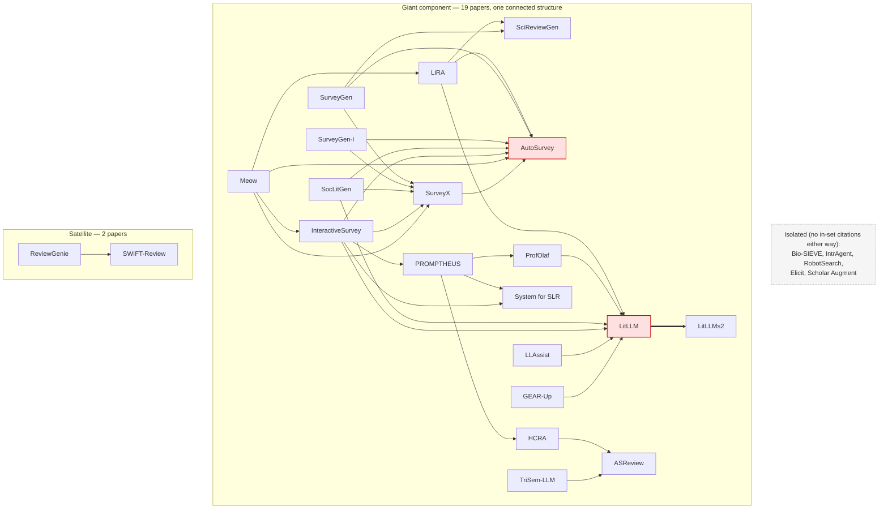

# Explicit Citation Graph — O(n) bottom-up extraction

Built 2026-07-13 by reading all 27 entries in `../deep-dives.md` (22 original + 5
verification cohort) and extracting every explicitly-named in-set citation from each entry's
"Relation to methods that came before it" and "Named limitations" fields — O(n) extraction, not
inference: only edges where one paper's own text names another paper from this set count.

**Why this exists:** `similarity-cluster.md` organizes the same 27 papers into 6 mutually
exclusive lineages (A–F). This audit checks that structure against what the papers actually say
about each other. Verdict: only 12 of 32 real edges are represented in the document — the
mutually-exclusive-bucket structure was silently dropping cross-lineage citations, confirmed with
direct textual evidence, not just suspected. See `similarity-cluster.md`'s own revision history
for what happens next.

---

## Diagram — all 32 explicit edges, grouped by actual graph structure

**Not** grouped by `similarity-cluster.md`'s A–F labels — those labels are Method 1's own
(unverified) output, and using them here would smuggle a disputed structure back in as if it were
neutral scaffolding. Grouping below is computed directly from this graph's own 32 edges via
connected components (undirected, since the question is "are these two papers part of the same
citation neighborhood," not edge direction): **19 of 27 papers form a single connected component**
— what looked like six separate lineages in the clustered version is, once the real edges are
drawn, essentially one graph. A 2-node satellite (`ReviewGenie`↔`SWIFT-Review`) and 6 fully
isolated papers (no citation edges to anything else in this corpus: Bio-SIEVE, IntrAgent,
RobotSearch, Elicit, Scholar Augment, ResearchRabbit) are the only real structural separations.
(Verified by union-find over the edge list, not eyeballed — see `implicit-pairwise-analysis.md`'s
union diagram for what happens to these isolates once implicit edges are added too.)

*LitLLM and AutoSurvey are highlighted — they're the two most-cited-into nodes in the corpus (7
incoming edges each), the real hubs holding the giant component together. `similarity-cluster.md`
splits them across three different lineage boxes (A, B, C) and treats each as one entry in its own
silo — that's the actual mechanism by which the bucket structure hides the field's real shape,
not just an incidental miscount.*

## Full edge table (32 edges)

| # | Source | Target | Relationship | Evidence |
|---|---|---|---|---|
| 1 | LitLLM | LitLLMs2 | extended by (own follow-up) | "Directly and explicitly extended by its own follow-up paper" |
| 2 | LitLLMs2 | LitLLM | extends/formalizes (same team) | "Directly extends and formalizes LitLLM (same team)" |
| 3 | LiRA | AutoSurvey | baseline / reuses metric code | "Positions itself directly against AutoSurvey... adapts AutoSurvey's own citation-quality metric code" |
| 4 | LiRA | SciReviewGen | echoes stated bottleneck | "echoing SciReviewGen's and LitLLM's own stated bottleneck" |
| 5 | LiRA | LitLLM | echoes stated bottleneck | same |
| 6 | ProfOlaf | LitLLM | positioned against | "LitLLM (lacks manual curation/snowballing entirely)" |
| 7 | HCRA | ASReview | positioned against, predecessor | "Positioned against ASReview... as measurable-but-not-fully-transparent predecessors" |
| 8 | SurveyGen | AutoSurvey | positioned against | "Positioned against AutoSurvey and SurveyX" |
| 9 | SurveyGen | SurveyX | positioned against | same |
| 10 | SurveyGen | SciReviewGen | positioned against (dataset) | "positioned against SciReviewGen as the closest prior dataset" |
| 11 | SurveyGen-I | AutoSurvey | forks on (end-to-end systems) | "end-to-end systems AutoSurvey, SurveyForge... and SurveyX" |
| 12 | SurveyGen-I | SurveyX | forks on | same |
| 13 | PROMPTHEUS | SLRAgents | closes gap left by | "closing a gap left by... Sami et al. 2024's multi-agent SLR" |
| 14 | PROMPTHEUS | ProfOlaf | contrasts (human-in-loop depth) | "not... like ProfOlaf, HCRA, or LitDiscover's staged workflow" |
| 15 | PROMPTHEUS | HCRA | contrasts (human-in-loop depth) | same |
| 16 | SocLitGen | LitLLM | historical-stage grouping | "2022-2024... systems (TAG, UR3WG, SLRs, LitLLM, RefAI)" |
| 17 | SocLitGen | AutoSurvey | historical-stage grouping + baseline | "2024-present... systems (ScholaCite, AutoSurvey...)" |
| 18 | SocLitGen | SurveyX | historical-stage grouping | same |
| 19 | TriSem-LLM | ASReview | positioned against | "active-learning approaches like ASReview" |
| 20 | InteractiveSurvey | LitLLM | positioned against (title-only flaw) | "Positioned against LitLLM, HiReview, AutoSurvey, PROMPTHEUS, Sami et al. 2024, and SurveyX" |
| 21 | InteractiveSurvey | AutoSurvey | positioned against | same |
| 22 | InteractiveSurvey | PROMPTHEUS | positioned against | same |
| 23 | InteractiveSurvey | SLRAgents | positioned against (Sami et al. 2024) | same |
| 24 | InteractiveSurvey | SurveyX | positioned against | same |
| 25 | Meow | AutoSurvey | positioned against | "retrieval-driven pipelines (AutoSurvey, SurveyX)" |
| 26 | Meow | SurveyX | positioned against | same |
| 27 | Meow | InteractiveSurvey | positioned against | "interactive/agentic frameworks (InteractiveSurvey, InsightAgent)" |
| 28 | Meow | LiRA | architectural contrast | "Key architectural contrast with LiRA's Outline Drafter Agent" |
| 29 | LLAssist | LitLLM | positioned against (contrast in scope) | "shares modular pipeline design, but targets related-work-section generation, not screening" |
| 30 | GEAR-Up | LitLLM | comparison (query-aug vs. retrieval) | "Relative to LitLLM-style retrieval: GEAR-Up upgrades the search query itself" |
| 31 | ReviewGenie | SWIFT-Review | positioned against | "Abstrackr, DistillerSR, RobotAnalyst, EPPI-Reviewer, SWIFT-Review, Colandr, Rayyan" |
| 32 | SurveyX | AutoSurvey | targets shortcomings / inherits metrics | "Directly targets three AutoSurvey shortcomings... Inherits and extends AutoSurvey's own evaluation metrics" |

No entry-text support was found for edges *from* SciReviewGen, System-for-SLR, Scholar Augment,
IntrAgent, or Bio-SIEVE to other in-set papers, nor from RobotSearch/Elicit/ResearchRabbit.

## Represented vs. missing

**12/32 represented** in `similarity-cluster.md` (diagram and/or prose): #1, #2, #3, #8, #11,
#14, #17, #20, #21, #22 (prose only), #24, #25, #32.

**20/32 missing**, disproportionately cross-lineage/cross-cohort:
- LiRA → SciReviewGen, LiRA → LitLLM (Lineage C → A, C → B)
- ProfOlaf → LitLLM (D → B)
- HCRA → ASReview (D → verification cohort) — not previously suspected
- SurveyGen → SurveyX, SurveyGen → SciReviewGen, SurveyGen-I → SurveyX (Lineage A internal)
- PROMPTHEUS → SLRAgents (D → E), PROMPTHEUS → HCRA (D internal)
- SocLitGen → LitLLM (F → B), SocLitGen → SurveyX (F → A)
- TriSem-LLM → ASReview (E → verification cohort)
- InteractiveSurvey → SLRAgents (A → E)
- Meow → SurveyX, Meow → InteractiveSurvey, Meow → LiRA (A internal, A → C)
- LLAssist → LitLLM (E → B)
- GEAR-Up → LitLLM (E → B)
- ReviewGenie → SWIFT-Review (E → verification cohort)

Every real citation edge inside Lineage E was replaced by a flat `---` "shared trait" chain in
the document — structurally honest per its own legend, but this is exactly what hid all six
Lineage-E cross-cutting edges above.

## Edges drawn in the document with no textual support

1. **SciReviewGen → AutoSurvey** — Lineage A's opening/anchor edge. Neither paper names the
   other; AutoSurvey's own Relation field cites RecurrentGPT/Temp-Lora/STORM/PaperRobot instead.
   The document's framing ("a diagnosis every later paper in this lineage either inherits or
   tries to fix") is the doc author's genealogical inference, not a stated citation.
2. **ResearchRabbit → SLRAgents** — added 2026-07-13 to fix Lineage E's traversal-framing problem;
   ResearchRabbit's own deep-dive never mentions SLRAgents. Same category of error, introduced
   while fixing a different one.
3. **ProfOlaf → HCRA** — technically fine (dashed, explicitly labeled "independently... not
   citation" in the doc's own prose), flagged for visibility only.
4. **AutoSurvey/SurveyX/SurveyGen-I → SGSimEval** (dashed) — unverifiable rather than
   confirmed-unfounded; SGSimEval has no deep-dive entry (listed only in Table 2), so there's no
   source text to check these against.

## Verification-cohort → original-22 links (previously invisible)

- **ASReview** cited by name in HCRA's and TriSem-LLM's Relation fields.
- **SWIFT-Review** cited by name in ReviewGenie's Relation field.
- RobotSearch, Elicit, ResearchRabbit: no citations found in any of the 22 originals.

---

**Next:** see `similarity-cluster.md` for how (or whether) this gets used to restructure the
document's organizing principle away from mutually-exclusive buckets.
