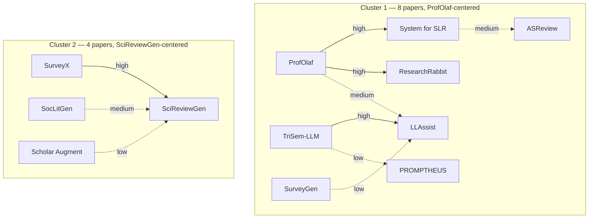
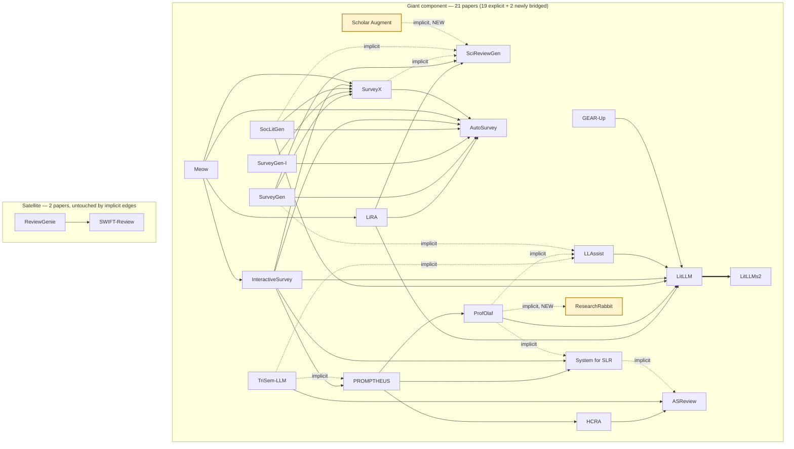

# Pairwise implicit-relationship lineage — content-matching, not citation-tracing

Built 2026-07-13. Third of three lineage-construction methods run over the same 27-paper corpus
(see `explicit-citation-graph.md` for the other two, and the top-level comparison once
written). This one asks a different question than citation-tracing: not "who cites whom," but
"whose mechanism answers whose named limitation, even if they never cite each other."

**Method:** date-ordered all 27 papers; for every paper B, checked its Problem/How-it-works fields
against every strictly-earlier paper A's Named-limitations field, judging a specific
mechanism-to-gap match (not vague thematic overlap). Cross-checked against the 32 known explicit
edges so only genuinely new (uncited) relationships are reported. Conservative and
**non-exhaustive** — same-year pairs mostly skipped, only ~a third of the ~300 theoretically
possible directed comparisons pursued in depth. The true implicit-edge count is likely higher
than what's below.

---

## Diagram A — the 10 implicit edges alone, grouped by their own structure

Grouping computed directly from these 10 edges via connected components (not
`similarity-cluster.md`'s A–F labels — see `explicit-citation-graph.md` for why those aren't used
as scaffolding here): **two real, genuinely disconnected clusters**, an 8-node ProfOlaf-centered
group and a 4-node SciReviewGen-centered group. No edge crosses between them — this method finds
two independent pockets of uncited-but-real structure, not one unified implicit graph. Edge color
= confidence.

*Solid arrow = high confidence, dashed = medium/low (labeled). Arrow direction reads "source's
mechanism addresses target's named limitation" — the reverse of citation-graph convention (there,
an arrow points from the paper making the critique to the paper being critiqued; here, chronology
forces the later paper to be the source, since it can't address a gap in something written after
it).*

## Diagram B — union with the 32 explicit edges (the real payoff)

The interesting question isn't what the 10 implicit edges look like alone — it's what they do
*to* the explicit graph when added on top. Computed via union-find over all 42 edges together:
**the giant component grows from 19 to 21 papers.** Two papers that were completely isolated
under citation-tracing alone — no citation to or from anything else in the corpus — get pulled
into the field's main connected structure once implicit relationships are counted:
**ResearchRabbit** (via ProfOlaf) and **Scholar Augment** (via itself, addressing SciReviewGen's
abstracts-only bottleneck). The `ReviewGenie`↔`SWIFT-Review` satellite stays untouched — no
implicit edge reaches either of them. Only **4 papers remain isolated even combining both
methods**: Bio-SIEVE, IntrAgent, RobotSearch, Elicit.

*Gold-highlighted nodes are the two isolates citation-tracing alone could never connect to
anything. This is the clearest single demonstration in this whole comparison: pure explicit
citation-tracing (a defensible, non-hallucinating baseline) structurally cannot recover these two
papers' real relationship to the field — only content-level comparison finds it.*

## Result: 10 new implicit edges (10 vs. 32 explicit, under a partial pass)

### High confidence

| Source → Target | A's named gap | B's mechanism |
|---|---|---|
| SurveyX → SciReviewGen | §5.3: hallucination/factuality failure root-caused to feeding only abstracts, not full text | AttributeTree distills full structured paper content into an "attribute forest" RAG base |
| TriSem-LLM → LLAssist | "analyzes only titles/abstracts (misses full-text info)" | Three-filter screening adds full-text similarity via 512-token block segmentation |
| ProfOlaf → System for SLR (Sami et al. 2024) | No defined inclusion/exclusion criteria; "questionable" extraction reliability; single-database (Scopus-only) search | Two-stage human screening with disagreement detection; TopicGPT structured extraction; multi-source snowballing (Google Scholar + Semantic Scholar + DBLP) |
| ProfOlaf → ResearchRabbit | No stopping criterion documented anywhere (literature-confirmed gap); Braun 2024 calls for systematic validation | Per-iteration Wohlin efficiency metric bounds/measures convergence; screening validated against independent human raters |

### Medium confidence

| Source → Target | A's named gap | B's mechanism |
|---|---|---|
| SocLitGen → SciReviewGen | Future work names extending beyond CS into other domains, "domain-agnostic by design" but unexercised | First review-generation framework purpose-built for a non-CS domain (social science), own 1.5M-paper bilingual corpus |
| System for SLR (Sami et al. 2024) → ASReview | "Automates only the screening step; the broader review process... remains unintegrated" | Four-agent pipeline spans search-string generation → screening → extraction → synthesis end-to-end |
| ProfOlaf → LLAssist | Declared future work: "add human feedback mechanisms," named as opposite of its own "simple tools" philosophy | Two-or-more-rater progressive screening with disagreement detection/discussion |

### Low confidence

| Source → Target | A's named gap | B's mechanism |
|---|---|---|
| Scholar Augment → SciReviewGen | Abstracts-only bottleneck | Full-OA-PDF download + full-text structured extraction (different task: extraction vs. narrative synthesis, weakens match) |
| SurveyGen → LLAssist | "doesn't use available metadata (year, citation counts) in scoring" | QUAL-SG weights academic-impact into re-ranking (different task: screening-relevance vs. survey-reference selection) |
| TriSem-LLM → PROMPTHEUS | "evaluated only proprietary OpenAI models, excluding open-source alternatives" | Deliberately uses an open-access LLM (Mixtral-8×7B via Together.ai) — never framed by TriSem-LLM as addressing PROMPTHEUS specifically |

---

## What this suggests

Two patterns stand out:

1. **Convergent-but-uncited re-solving.** The "abstracts-only causes hallucination" gap, diagnosed independently by SciReviewGen and LitLLM, gets silently re-solved by at least two later systems (SurveyX, Scholar Augment) that never trace their design back to either diagnosis. The field is converging on the same fix from multiple independent directions, not building a visible citation chain — citation-tracing alone makes this convergence invisible.
2. **One paper can carry a lot of the field's real problem-solving lineage invisibly.** ProfOlaf alone implicitly answers named gaps in three different earlier papers (Sami et al.'s SLR system, ResearchRabbit, LLAssist) without citing any of them.

**Scaling implication (the question that motivated this experiment):** at only 27 papers and a
non-exhaustive pass, implicit relationships already run at roughly a third the volume of explicit
ones. The expectation, not yet tested at larger scale, is that this ratio widens rather than
narrows as the corpus grows — larger literatures produce more independent convergence, not less,
meaning pure citation-tracing becomes a progressively worse proxy for the field's actual structure
the bigger the corpus gets. Testing this properly would need the same measurement repeated at a
couple of different corpus sizes — a single run here is a snapshot, not a trend.
