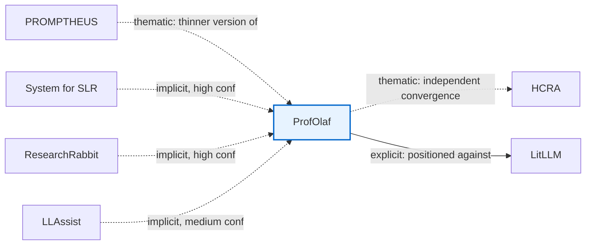

# Lineage Comparison — one paper, three methods

Three methods were run over the same 27-paper corpus (`../deep-dives.md`): `similarity-cluster.md`
(thematic clustering), `explicit-citation-graph.md` (O(n) extraction of only what papers state
about each other, 32 edges), and `implicit-pairwise-analysis.md` (O(n²)-ish content-matching for
uncited-but-real relationships, 10 more edges). They disagree more than expected — only 12 of the
32 explicit edges survive into the clustered document, and the 10 implicit edges are invisible to
both other methods. **ProfOlaf**, drawn all three ways below, makes the disagreement concrete: it
explicitly cites 4 corpus papers and implicitly (uncited) answers named gaps in 3 more.

---

## ProfOlaf, three ways

| | What it draws | What it captures | What it misses |
|---|---|---|---|
| **Method 1** (`similarity-cluster.md`) | 1 edge — thematic grouping with HCRA/PROMPTHEUS | Real convergence: all three claim human-in-the-loop design; correctly flags PROMPTHEUS's version as thinner | Everything ProfOlaf actually cites (4 papers, only 1 in-corpus) and everything it implicitly answers — invisible once assigned to a single bucket |
| **Method 2** (`explicit-citation-graph.md`) | 1 edge — ProfOlaf→LitLLM | The one edge crossing Method 1's lineage boundary (D→B), absent from that diagram entirely | Anything ProfOlaf doesn't say about itself — no way to find mechanism-to-gap matches it never states |
| **Method 3** (`implicit-pairwise-analysis.md`) | 3 edges — SLRAgents, ResearchRabbit, LLAssist → ProfOlaf | 3 specific mechanism-to-gap matches, none cited, none visible to Methods 1 or 2 | Can't distinguish "inspired by" from "independently arrived at" — why every edge here carries a confidence grade and stays dashed |

**Six real relationships. No single method found more than half.** Method 1: 2. Method 2: 1
(a different one). Method 3: 3 (all different from the other two). That's the concrete case for
why implicit pairwise-matching — not just citation-tracing or thematic grouping — is necessary to
engage a field's real structure, not an optional nice-to-have.

The three mechanism-to-gap matches, for reference: Sami et al.'s SLR system names no defined
inclusion/exclusion criteria, single-database search, and "questionable" extraction reliability —
ProfOlaf's two-stage human screening, multi-source snowballing, and TopicGPT-structured extraction
answer all three (high confidence). ResearchRabbit's literature-documented gap (no stopping
criterion, no published validation) — ProfOlaf's per-iteration Wohlin efficiency metric and
independent-rater validation directly address it (high confidence). LLAssist's own declared future
work ("add human feedback mechanisms") — ProfOlaf's disagreement-surfacing multi-rater design is
such a mechanism, though this reads more like independent convergence than a targeted response
(medium confidence).

---

## Why the methods diverge: task design, not model quality

All three methods use the same underlying LLM capability — the divergence comes from what task
each one was given:

- **Clustering** asked for open-ended narrative synthesis. The lossiest, riskiest task: missed 20
  of 32 real edges and fabricated 3 that no source text supports (including the load-bearing
  SciReviewGen→AutoSurvey edge in `similarity-cluster.md`). Unconstrained generation both drops
  real signal and invents fake signal — the same two failure modes
  `check_citation_grounding()` (`../decisions.md`) exists to catch elsewhere in this project.
- **Explicit extraction** asked a narrow, verifiable question ("does this paper's own text name
  that paper?"). Precision-maximizing, recall-limited: zero fabrication risk, but structurally
  blind to anything an author didn't say themselves — not a failure, a boundary.
- **Pairwise implicit matching** asked a constrained comparative judgment ("does B's mechanism
  address a limitation A explicitly named?"). Recall-enhancing: found 10 edges neither other
  method could reach, at the cost of needing explicit confidence grading to bound false positives.

"Let an LLM summarize/relate the literature" is not one operation with one reliability profile —
open synthesis loses signal, constrained extraction caps it, constrained comparison amplifies
hidden signal. Worth naming explicitly if this ever becomes its own methods point rather than
staying wiki-internal.

---

## At corpus scale: the union changes the shape, not just the edge count

`explicit-citation-graph.md`'s 32 edges alone resolve into one 19-paper giant component, a
2-paper satellite (`ReviewGenie`↔`SWIFT-Review`), and 6 fully isolated papers — Bio-SIEVE,
IntrAgent, RobotSearch, Elicit, Scholar Augment, ResearchRabbit — with zero citation edges to
anything else in the corpus, verified by union-find, not eyeballed.

Add the 10 implicit edges (`implicit-pairwise-analysis.md`'s "Diagram B"): **ResearchRabbit and
Scholar Augment** get pulled into the giant component. Not because they cite or are cited by
anything — they still don't — but because their mechanisms answer named gaps already inside it
(ResearchRabbit via ProfOlaf's stopping-criterion answer; Scholar Augment via its full-text
extraction answering SciReviewGen's abstracts-only bottleneck). The giant component grows from 19
to 21. Only 4 papers remain isolated under both methods combined.

This is the strongest evidence in the whole comparison: citation-tracing is a genuinely
trustworthy, non-hallucinating baseline, but it is **structurally incapable** of recovering these
two papers' real place in the field — the information those edges depend on was never in either
paper's citation list to begin with. Only content comparison finds it. Same finding as the
ProfOlaf example, confirmed at corpus scale.

---

## What this means for `similarity-cluster.md`

**Decision (2026-07-13): deprecated, not rebuilt.** Given the scale of what's missing (20 of 32
explicit edges, plus 10 implicit edges that reshape the corpus's actual connectivity), rebuilding
it "correctly" was considered and rejected — it would either duplicate `explicit-citation-graph.md`
or keep forcing the mutually-exclusive-bucket shape this comparison has twice shown to be wrong
for this corpus. `similarity-cluster.md` now stays as the deprecated control condition in this
comparison — unedited evidence of what naive thematic clustering produces — while actual paper
prose drafts directly from `explicit-citation-graph.md` and `implicit-pairwise-analysis.md`, as
already done for `related-work.tex`'s rewritten paragraph.
