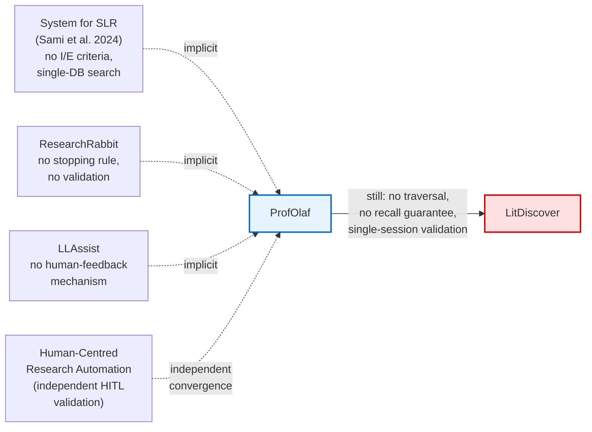

# Related Work figure — mockup v2, ProfOlaf-centered

Scratch mockup for the IP&M draft's "Automated systematic review and evidence synthesis"
paragraph, rewritten 2026-07-13 to use `implicit-pairwise-analysis.md`'s findings as primary
source. Supersedes the deleted v1 mockup (flat 3-cohort funnel: Generation/Discovery-only/HITL).
Not a wiki artifact — delete once the TikZ/paper version is finalized and compiled into
`litdiscover_ipm.tex`.

**Why the redesign:** the old funnel treated ProfOlaf as one of two interchangeable "HITL cohort"
members. The implicit pairwise pass found something sharper: ProfOlaf isn't just thematically
similar to HCRA, it is the field's most integrative single system, uncitedly answering named gaps
in three *different* papers (SLRAgents, ResearchRabbit, LLAssist) — and still falls short of
LitDiscover on citation-graph traversal + validated recall. One target, three converging arrows,
one final gap. Matches `related-work.tex`'s rewritten paragraph exactly.

**Notes / open questions for the paper version:**
- The AutoSurvey/LiRA "generation cohort" paragraph (immediately before this one in
  `related-work.tex`) isn't touched by this redesign and doesn't need its own figure — it's two
  sentences with one clean pivot quote from LiRA, dense enough to stand as prose alone.
- HCRA is dashed into ProfOlaf here as "independent convergence," matching the paragraph's own
  language — it is *not* one of the three implicit-pairwise edges (those are SLRAgents,
  ResearchRabbit, LLAssist specifically); keeping it visually distinct (still dashed, but no
  "implicit" label) preserves that distinction.
- For the actual paper, this becomes a TikZ figure matching `elsarticle`'s conventions — this file
  is purely for reviewing the shape/wording before that work.
