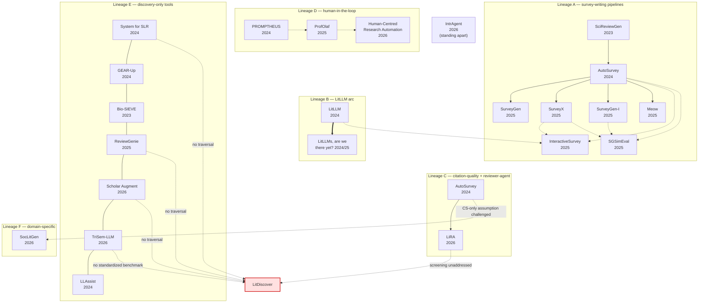
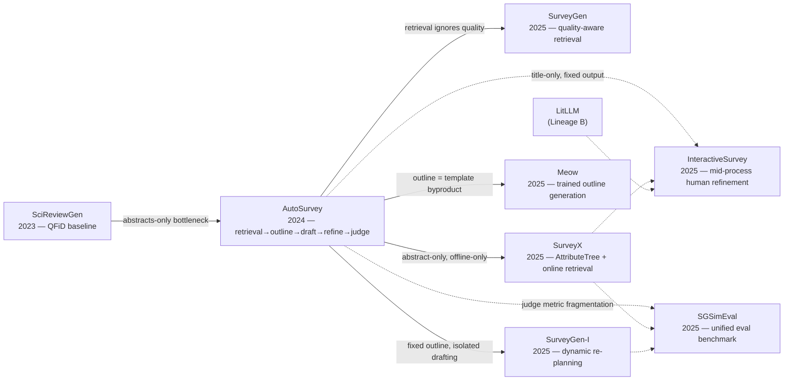
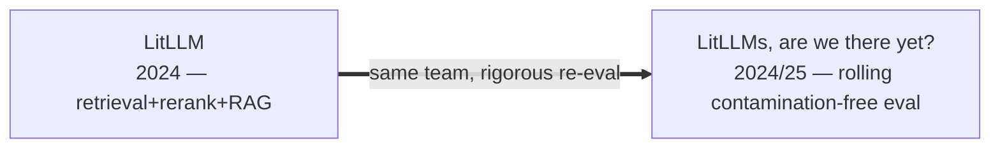
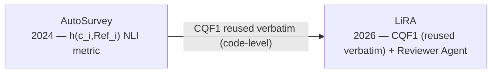
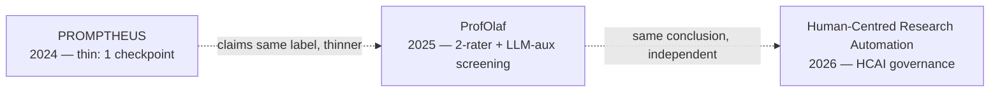
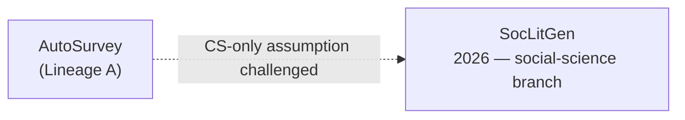
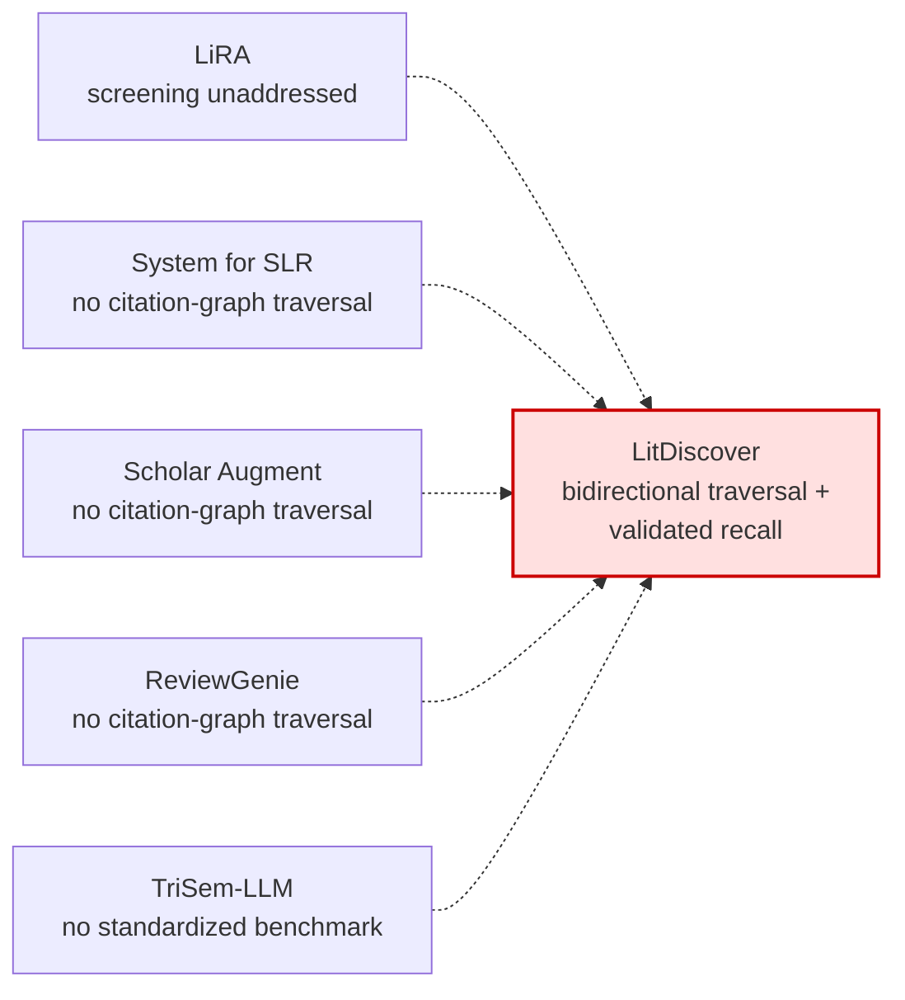

# Automated Literature Review — Similarity-Cluster Lineage (DEPRECATED — reference artifact only)

**Status (2026-07-13): deprecated, not being rebuilt.** This document is no longer a source for
drafting paper prose — that job moved to `explicit-citation-graph.md` (ground truth) and
`implicit-pairwise-analysis.md` (richest signal); `../../../../lit-review/robust-literature-discovery/
drafts/ipm-submission/related-work.tex`'s current paragraph was drafted directly from those two,
not from this file. Kept intact, unedited, as the **control condition** in
`lineage-comparison.md`'s three-method comparison — concrete evidence of what naive thematic
clustering produces and why it isn't trusted, not a document anyone should read for its edges.
Rebuilding it "correctly" was considered and rejected: doing so would either duplicate
`explicit-citation-graph.md`'s content, or keep forcing a mutually-exclusive-bucket shape that's
now been shown twice (the 19-node giant component in `explicit-citation-graph.md`, the 6-edge
ProfOlaf case in `lineage-comparison.md`) to be the wrong shape for this corpus. More effort here
buys nothing the other two documents don't already deliver.

**Method: thematic clustering.** Papers grouped into 6 lineages (A–F) by subject-matter/approach
similarity, written as narrative prose. One of three lineage-construction methods run over the
same corpus — see `lineages/` siblings `explicit-citation-graph.md` (O(n) bottom-up extraction of
only what papers explicitly say about each other) and `implicit-pairwise-analysis.md` (O(n²)
content-matching for uncited-but-real relationships), plus `lineage-comparison.md` for a worked
example showing how the three disagree on the same paper.

**Known limitation (audited 2026-07-13, see `explicit-citation-graph.md`):** this document's
bucket structure was checked against what the papers actually cite, and only 12 of 32 real
citation edges are represented here — 20 were silently dropped because they crossed a lineage
boundary, and 3 edges drawn below (including the opening SciReviewGen→AutoSurvey edge) have no
textual support at all. Do not use the content or edges below for anything beyond understanding
what thematic clustering got wrong — cross-check any claim against `explicit-citation-graph.md`
or `implicit-pairwise-analysis.md` before reusing it.

Traces *who answers whom* across the 22 method papers in `../../../litdiscover/deep-dives.md` — connected
chains where System B exists because System A left a named gap, not just a list of isolated
deep-dives.
Modeled on `260708 literature-review.pdf`'s structure: named lineages, an evaluation-methods
lineage, a Discussion section naming the field's actual meta-gap, and Next Steps that puts the
lineage to use rather than leaving it as an observation.

The backbone reuses SocLitGen's own 3-stage historical framework (the only paper in this set that
proposed one): **Stage 1 (pre-2022)** weak retrieval, weak planning, text-extraction-and-
concatenation → **Stage 2 (2022–2024)** enhanced retrieval, still-weak planning → **Stage 3
(2024–present)** enhanced retrieval + enhanced planning + LLM-generative synthesis. All 22 papers
in this review sit in Stage 3 or later.

---

## Diagrams

A flat 22-node diagram was unreadable — Mermaid's default layout has no sense of clustering, so it
optimizes edge-crossing across all 22 nodes as one blob. Fixed two ways: the big-picture view below
uses `subgraph` blocks to keep each lineage spatially grouped (same information, but legible), and
each lineage section further down also has its own small standalone diagram right where it's
discussed, for reading section-by-section rather than parsing the whole field at once. Legend,
shared across all of them: **solid arrow** = explicit "answers a named gap in" relationship stated
in the source paper; **dashed arrow** = shared critique/convergence without direct citation;
**plain line (`---`)** = grouped by shared trait, not citation.

### Big picture — all six lineages clustered

*`AutoSurvey` appears twice (once per lineage it participates in — A and C) since Mermaid subgraphs
require each node to belong to exactly one cluster; treat `AutoSurveyA`/`AutoSurveyC` as the same
paper. IntrAgent sits outside every subgraph — it belongs to no lineage (different task entirely).*

---

## Lineage A — Survey-writing pipelines (the "write the whole survey" arc)

**SciReviewGen (2023)** supplies the dataset and the first serious baseline (QFiD) — and, load-
bearing for everything downstream, its own §5.3 root-causes hallucination/factuality failure to
**abstracts-only input**, a diagnosis every later paper in this lineage either inherits or tries
to fix.

**AutoSurvey (2024)** is the field's actual reference architecture: retrieval → outline → parallel
subsection drafting → refine → Multi-LLM-as-Judge best-of-N. Its ablation is the single most-cited
empirical fact in this whole corpus — removing retrieval drops citation recall 83%→60%, i.e.
*retrieval quality, not generation cleverness, is what makes a survey good*. Three papers then
fork off it, each naming a different piece of AutoSurvey it left unaddressed:

- **SurveyGen (2025)** forks on *retrieval quality itself* — AutoSurvey's pure similarity retrieval
  ignores paper quality/impact/influence; QUAL-SG adds co-citation expansion (catches foundational-
  but-topically-dissimilar papers) and an academic-impact score alongside topical relevance.
- **SurveyX (2025)** forks on *input depth and reach* — AutoSurvey's title/abstract-only input and
  offline-only corpus; AttributeTree extracts structured full-paper content, and an online Google
  Scholar crawler adds live retrieval. Also adds the field's first automated figure/table generation.
- **SurveyGen-I (2025)** forks on *planning rigidity* — AutoSurvey's fixed once-for-all outline and
  isolated parallel subsection generation; PlanEvo dynamically re-plans the outline via a
  Memory-Guided Structure Replanner after each writing stage, and adds citation-tracing to resolve
  indirect citations (e.g. "(Smith et al., 2022)" embedded inside a retrieved passage) that pure
  retrieval-then-cite misses entirely.

Two further, narrower forks target sub-problems inside the AutoSurvey-style pipeline rather than
the pipeline as a whole:

- **Meow (2025)** forks specifically on *outline generation* — reframes it from a template-filling
  byproduct of a general LLM call (AutoSurvey's, SurveyX's, and InteractiveSurvey's shared
  approach) into its own trained task: a fine-tuned 8B model with a learned structural reward
  (tree-edit-distance vs. human outlines). Draws its intellectual lineage from taxonomy-induction
  research, not the survey-writing-agent tradition — a genuinely different ancestry.
- **InteractiveSurvey (2025)** forks on *the all-or-nothing output problem* — explicitly names
  AutoSurvey, SurveyX, LitLLM, HiReview, and PROMPTHEUS as all sharing the same flaw: title-only
  input, fixed non-editable output. Adds mid-process human refinement at every stage (clustering,
  outline, content) instead of only accept-or-regenerate.

**SGSimEval (2025)** is this lineage's evaluation-side convergence point — it doesn't propose a
method, it unifies AutoSurvey's Multi-LLM-as-Judge, SurveyForge's outline-rationality scoring, and
LLMxMapReduce-V2's criticalness/language dimensions into one cross-system benchmark, the first to
score outline+content+references together. See the Evaluation-Methods Lineage below.

---

## Lineage B — The LitLLM team's two-paper arc (related-work sections, not full surveys)

**LitLLM (2024)**: keyword+embedding retrieval → LLM re-ranking (permutation or debate-with-
attribution) → single-pass RAG generation of a related-work section (narrower scope than a full
survey). Its own Future Work section names the abstracts-only bottleneck independently of
SciReviewGen — two teams converging on the same diagnosis without citing each other on this point.

**LitLLMs, are we there yet? (2024/25)** is the same team's rigorous follow-up: replaces LitLLM's
informal 5-researcher demo with a contamination-free rolling benchmark (RollingEval), and finds
two things that cut against the "more sophisticated is better" intuition — embedding-based
(SPECTER2) re-ranking beats LLM-prompting re-ranking, and GPT-4-as-reranker produces an incomplete
ranked list ~40% of the time. This pairing is the lineage's clearest case of a team correcting
its own earlier work's methodology rather than a competitor doing it.

---

## Lineage C — The citation-quality-metric-and-reviewer-agent arc

**AutoSurvey (2024)** introduces the `h(c_i, Ref_i)` NLI-based per-claim citation-quality metric
(recall/precision over whether a claim is actually entailed by its cited source) — this is the
foundational eval-methodology contribution of the whole corpus.

**LiRA (2026)** reuses that metric **verbatim, adapted from AutoSurvey's own released code**
(confirmed at the code level, not just the paper — see `../../litdiscover/litdiscover.md`'s code-level
correction), rebrands it CQF1, and beats AutoSurvey substantially on it (0.76/0.73 vs. ≤0.63).
LiRA adds a genuinely new mechanism on top: a Reviewer Agent that evaluates intermediate outputs
(outline, draft) against a completeness/clarity rubric and triggers up to 3 regeneration rounds —
though code-level inspection (`../../litdiscover/litdiscover.md`) confirmed this Reviewer Agent is a *general* quality
gate, not citation-specific, and CQF1 itself is computed offline for benchmarking, not live during
generation. **LiRA's own stated future work explicitly names "integration of the screening and
search criteria definition steps within the pipeline" as unaddressed** — LiRA assumes references
are already curated. This is the single most direct acknowledgment, from a competitor's own paper,
of the exact gap LitDiscover's discovery/traversal work fills.

---

## Lineage D — Human-in-the-loop governance arc

Three papers converge on the same claim independently, from different angles:

**ProfOlaf (2025)**: two-or-more human raters + optional LLM-as-auxiliary-rater, with disagreement
surfacing. Its own §3.3.4 concludes LLMs "are not yet sufficiently reliable to operate
autonomously" for complex tasks (topic modeling) and are "maximized in a human-in-the-loop
setting" — a failure analysis, not a design preference stated up front.

**Human-Centred Research Automation (2026)**: independently reaches the same conclusion via a
head-to-head screening comparison — Llama 3.1 beats classical/embedding filters by only 3–11
points at 10-30x the latency, explicitly citing EU AI Act / HCAI principles as the reason humans
stay in the loop for ambiguous cases.

**PROMPTHEUS (2024)** claims the "human-centered" label too, but code/paper-level inspection shows
it's much thinner than the other two — the *only* human checkpoint is upstream (supplying the
research question); Selection, Extraction, and Synthesis run with zero human checkpoints or
override mechanism. Its own Limitations section concedes this by naming hallucination mitigation
as *future* work rather than a built-in feature. Useful contrast: three papers claim the same
philosophy, only two actually implement checkpointed human oversight throughout the pipeline.

---

## Lineage E — Discovery/extraction-only tools (no full-review synthesis)

```mermaid
graph LR
    SLRAgents["System for SLR w/<br/>Multiple AI Agents<br/>2024"]
    GEARUp["GEAR-Up<br/>2024"]
    BioSIEVE["Bio-SIEVE<br/>2023"]
    ReviewGenie["ReviewGenie<br/>2025"]
    ScholarAugment["Scholar Augment<br/>2026"]
    TriSemLLM["TriSem-LLM<br/>2026"]
    LLAssist["LLAssist<br/>2024"]
    ResearchRabbit["ResearchRabbit<br/>(product, not a paper)"]
    SLRAgents --- GEARUp --- BioSIEVE --- ReviewGenie --- ScholarAugment --- TriSemLLM --- LLAssist
    ResearchRabbit -.->|"does traverse, but no<br/>stopping rule/validation"| SLRAgents

    classDef productNode fill:#fff3cd,stroke:#b8860b,stroke-width:1.5px,stroke-dasharray: 4 2;
    class ResearchRabbit productNode;
```

*Grouped by shared trait, not citation — plain lines, no arrowheads. Six of the seven share "no
citation-graph traversal at all." **ResearchRabbit is the exception, not a confirmation** — see
below.*

These don't write surveys at all — they automate search, screening, or extraction as standalone
tools, closer in scope to LitDiscover's own traversal/screening stages than to Lineage A's
generation-focused systems:

- **System for SLR using Multiple AI Agents (2024)** has the closest architectural shape to
  LitDiscover's own staging (search-string → title filter → abstract filter → full-text/per-RQ
  extraction → synthesis) — but its "literature identification" step is a single keyword-search
  query against one database (Scopus), with **no citation-graph traversal at all**. Its own
  "Limitation" section is unusually candid: sub-optimal search strings (no Boolean "AND"), no
  clear inclusion/exclusion criteria, and "questionable" extraction reliability.
- **GEAR-Up (2024)** upgrades only the *search query itself* (KG + LLM-generated query variants
  feeding PubMed, re-ranked by FAISS) — a front-end augmentation, not a discovery mechanism.
- **Bio-SIEVE (2023)** fine-tunes an open LLM specifically for biomedical screening, explicitly
  positioned against zero-shot ChatGPT's documented behavior drift and topic-inconsistent
  performance — the strongest "why not just prompt a general LLM" rebuttal in the corpus.
- **ReviewGenie (2025)** and **Scholar Augment (2026)** are both linear, keyword/API-search-only
  pipelines with **no citation-graph traversal or snowballing whatsoever** — they cannot surface
  papers missed by the initial search string, a structural limitation LitDiscover's bidirectional
  traversal exists specifically to solve. Scholar Augment's 99.32% time-reduction headline also has
  **zero accuracy evaluation anywhere in the paper** — a real methodological gap, not an oversight
  the authors hide (their own future-work section proposes cross-LLM-provider validation to catch
  hallucinated extractions, meaning no such check exists today).
- **TriSem-LLM (2026)** explicitly disclaims proposing new NLP methods — its contribution is
  integration discipline: trilingual (EN/ES/FR) embeddings, a deliberate **no-early-exclusion**
  multi-criteria screen (a direct structural cousin of LitDiscover's own decision not to gate
  traversal on a single yield/keyword signal), and full PRISMA-aligned decision traceability. Names
  CLEF TAR / SYNERGY standardized benchmarking as future work it hasn't done — exactly the
  standardized closed-corpus validation LitDiscover already has.
- **LLAssist (2024)** is the lineage's minimalist outlier — single-LLM-call screening/triage only,
  deliberately avoiding Joos et al.'s multi-agent consensus approach to cut cost/complexity, with
  no synthesis step at all. Its own future work (full-text analysis, human feedback, domain-
  specific models) is explicitly the opposite of its stated "simple tools" philosophy — a
  deliberate first step, not an end state, by the authors' own framing.
- **ResearchRabbit** (product, not a peer-reviewed paper — full deep-dive in
  `../../../litdiscover/deep-dives.md`'s verification cohort) is the one case in this lineage that genuinely
  **does** do citation-graph traversal — co-citation and bibliographic-coupling signals from
  user-supplied seed papers, mechanically closer to LitDiscover's own bidirectional traversal than
  any of the six papers above. This matters for how this lineage's claim is stated: "no
  citation-graph traversal at all" is not the universal differentiator it was written as — it's
  true of six of the seven tools here, not all of them. ResearchRabbit's actual gap is sharper and
  arguably stronger evidence for LitDiscover's contribution, not weaker: even a tool that *does*
  traverse the citation graph has no formal stopping/convergence rule and no published validation
  against a real bibliography (an independent comparative test found only 3/50 overlaps between
  ResearchRabbit's own output and an architecturally similar tool, Connected Papers, on the same
  seed — evidence the method isn't even reproducible across runs of "the same kind of tool," let
  alone validated against ground truth). LitDiscover's edge isn't "we traverse and others don't" —
  it's "we traverse *with* a validated stopping rule and closed-corpus recall guarantee," and that
  claim survives even the closest non-paper case in the field.

---

## Lineage F — The domain-specific branch

**SocLitGen (2026)** stands genuinely apart from every CS-focused system above: the first
framework in *any* domain purpose-built for social science, with a different review-organization
logic (competing theoretical perspectives, not chronological technological evolution) and a
different literature-comprehension target (theory/method/sample/data relationships, not task/
technical-solution extraction). It beats AutoSurvey on content quality but **not** on citation
quality (no significant difference) — the one clear data point in this whole corpus where a
domain-specialized system doesn't out-perform the CS-generalist baseline on the metric that
matters most for LitDiscover's own comparison axis.

---

## Standing apart — a genuinely different task

**IntrAgent (2026)** doesn't belong in any lineage above — it solves single-paper content-grounded
QA (IntraView: given one paper and a query, answer faithfully or flag absence), not multi-paper
discovery or synthesis. Included in this review only because "reading behavior mimicry" (its
core mechanism — hierarchical section-ranking + iterative sufficiency-checked reading) is a
candidate design lineage worth citing if LitDiscover ever frames its own screening step as mimicking
human reading order, not because it competes on the same task.

---

## Evaluation-Methods Lineage

Three separate lineages hide inside "how do you know it worked":

1. **Citation-grounding metrics**: AutoSurvey's `h(c_i,Ref_i)` NLI check → LiRA's CQF1 (reused
   verbatim) → **LitDiscover's `check_citation_grounding()`** (shipped 2026-07-11), which is ahead
   of both precedents on one specific axis: it runs live, on every synthesis call, not as an
   offline benchmarking-only metric the way CQF1 and `h(c_i,Ref_i)` are used in both source papers.
2. **Survey-quality unification**: AutoSurvey's Multi-LLM-as-Judge + SurveyForge's outline-
   rationality scoring + LLMxMapReduce-V2's criticalness/language dimensions, each invented
   independently → **SGSimEval** unifies all three into one cross-system framework, the first to
   score outline+content+references together with human-similarity-weighted scoring.
3. **Screening-accuracy validation**: Cohen's Kappa (ProfOlaf, ReviewGenie, Bio-SIEVE) and
   confusion-matrix precision/recall/F1/specificity (TriSem-LLM) validate *discovery/screening*
   decisions against human judgment — a structurally different concern from (1) and (2), which
   validate *generated text*. **SocLitGen's ICC + Fleiss' Kappa evaluator pre-check** is the one
   paper in the corpus that validates its *human evaluators'* reliability before trusting their
   scores at all — a rigor step every other paper here skips.
4. **Contamination-free benchmarking**: LitLLM/LitLLMs' RollingEval (arXiv papers timestamped
   after a fixed cutoff) is the corpus's only answer to the "is the model just remembering the
   answer" problem — directly relevant if LitDiscover's own APS-simulation validation ever faces
   a staleness critique.

---

## Discussion — the field's actual meta-gap

Reading all 22 papers together, not one of them makes LitDiscover's specific claim: **recall
against a real published survey's full bibliography, in a large closed corpus, with structural
explanation of what's missed.** Three near-misses, each falling short in a different way:

- **Screening-accuracy papers** (ProfOlaf, HCRA, TriSem-LLM, Bio-SIEVE, ReviewGenie) validate
  precision/recall of *include/exclude decisions* against a human-curated sample — dozens to a few
  hundred articles, not a full survey's hundreds of ground-truth references, and never asking
  whether the *discovery* process itself (not just the screening of what discovery found) reached
  everything.
- **Retrieval-coverage papers** (LitLLM/LitLLMs' RollingEval) measure "% of ground-truth references
  in the top-100" for a *related-work section* on a recent single paper — a narrower, single-paper
  version of the same idea, not validated against a full survey's complete bibliography.
- **Generation-quality papers** (AutoSurvey, SurveyX, LiRA, Meow, SGSimEval) almost universally
  *assume the reference set is already given* — LiRA says this explicitly about itself. They
  measure how well a system writes from curated references, never whether the references were
  correctly and completely found in the first place.

LitDiscover's 89–98% recall against three real APS survey bibliographies (432–582 references each,
in a 700k-paper corpus), with an explicit structural account of what's missed (peripheral,
low-in-degree papers at BFS distance 1), is not a stronger version of anything in this lineage —
it's a claim nobody else in the corpus is even attempting to make.

---

## Next Steps — scaffolding the Related Work section

The IP&M redo's Related Work section should be structured by lineage, not as 22 flat citations:

1. **Open with Lineage A** (survey-generation pipelines) as the field's mainstream — 2-3
   sentences, citing AutoSurvey + one or two forks (SurveyX, SurveyGen-I) as representative, not
   all six.
2. **Lineage C** (citation-quality/reviewer-agent arc) gets its own paragraph — this is where
   LiRA's own stated gap ("integration of screening and search criteria definition... unaddressed")
   becomes the direct pivot sentence into LitDiscover's contribution.
3. **Lineage D** (human-in-the-loop governance) supports the staged-not-autopilot design
   philosophy — cite ProfOlaf's and HCRA's independent failure-analysis conclusions as external
   validation, not just an internal design choice.
4. **Lineage E** (discovery-only tools) is the most direct comparison set — this is where the
   "no citation-graph traversal at all" observation (true of System-for-SLR, GEAR-Up, ReviewGenie,
   Scholar Augment, TriSem-LLM) does the real differentiating work. **Worth using ResearchRabbit
   here too, as the stronger version of the argument**: even the one close comparator that *does*
   traverse the citation graph has no stopping rule and no published validation — showing
   LitDiscover's edge is the validated stopping rule and closed-corpus recall guarantee, not merely
   "we traverse and others don't."
5. **Close with the Discussion section's meta-gap paragraph** verbatim-adapted — the claim nobody
   else makes, stated plainly as the paper's contribution relative to everything surveyed above.

This also directly answers IP&M's desk-rejection complaint (missing SOTA/LLM baselines and
current-year references) — the lineage covers 2023–2026 work across every sub-task LitDiscover
touches, not just the two or three most obviously similar systems.
