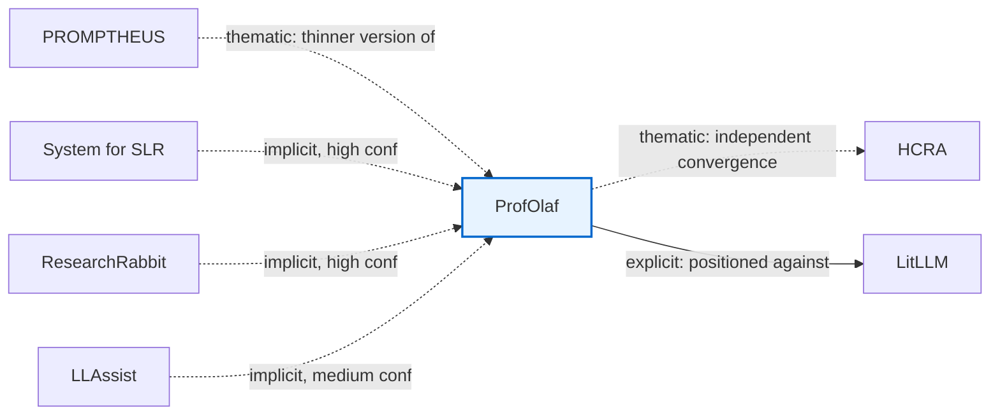

# Synthesis

One file, most-important-first — same collapsing treatment as `wiki/litdiscover/litdiscover.md`
(2026-07-21, session 45). Replaces `roadmap.md`, `q-synth-plan.md`,
`representation-learning-plan.md`, `background/eval-standard-gap.md`,
`background/reference-implementation-survey.md`, and `example-comparison/`'s four files (2,064
lines across 9 files, nested three directories deep — buried enough that the eval-standard-gap
finding below got missed in a later session's own review of this project). Full detail (the raw
32/10-edge tables, the per-system code-fidelity deep-dives, the mermaid diagrams not kept below)
is in git history if ever needed.

---

## The goal

Given a curated paper set (recovered by LitDiscover), organize it into interpretable structure —
clusters/lineages, temporal emergence, influence hubs — useful to someone writing a literature
review on that topic. **Not** narrative-text generation (that's the AutoSurvey/PROMPTHEUS/SurveyX
line of work, cited below as prior art, not a competitor).

Three genuinely different subroutines attempt this, disjoint mechanisms answering the same
question, worth running independently rather than picking one prematurely — `example-comparison`
below already showed no single method in its own family recovered more than half of a corpus's
real structure.

| Track | Mechanism | Status | Next action |
|---|---|---|---|
| **Q-SYNTH** | Graph-native: Leiden community detection + power-law fitting + NST/UMAP/SG-t-SNE embedding, on real citation-graph data (APS `C` matrix) | Not started, first blocker cleared 2026-07-14 (gold set verified, 52 papers) | Build the 1-hop subgraph and run Leiden once — cheaper than waiting on planner/architect sprint-planning first |
| **Representation learning** | Embedding-native: does a structured 6-field paper summary embed better for clustering than raw/lightly-processed text? | Partially prepped — section-level ground truth built for 3 live surveys, pipeline not yet run | Resolve 3 open design decisions (full-text pooling, k-fixed-vs-elbow, flat-vs-hierarchical scoring), then run |
| **LLM-text-native (`example-comparison`)** | Explicit citation-graph extraction + implicit mechanism-to-gap matching, on paper *text* not graph data | **Complete, as a control condition** — already draft LitDiscover's own related-work section | None — done, archived, not blocked |

**Why three, not one:** each targets a different failure mode. Q-SYNTH asks whether respecting
citation *direction* preserves lineage structure direction-blind methods lose. Representation
learning asks whether *what gets embedded* is the fixable part of a documented clustering failure.
`example-comparison` already answered a narrower, adjacent question — is LLM-text-based clustering
structurally capable of representing a field's real citation topology — and found no: a
single-membership partition can't represent papers that are real hubs across multiple lineages
(LitLLM/AutoSurvey each cited into 7 times, split across 3 buckets in the deprecated clustering
version). That finding motivates *why* the other two tracks are worth running separately rather
than assuming a better prompt or embedding model fixes clustering on its own.

**What "rigor" means before any track counts as a real result:**
- **Q-SYNTH:** passing the domain-expert sanity check on the actual K17-RGC subgraph, not just
  running the pipeline — a plausible-looking cluster map with no expert check is exactly the
  failure mode `example-comparison` already demonstrated for a different method.
- **Representation learning:** a result on real held-out ground truth (the 3 live-survey section
  structures), not "structured summaries look more organized." Q-SYNTH's own NST result (below)
  is the same caution restated: a hypothesis surviving intuition isn't the same as surviving a
  held-out test.
- **Both together:** if Q-SYNTH and representation learning reach compatible conclusions about
  what structures a field well, that convergence across genuinely disjoint mechanisms is a
  stronger claim than either alone — worth checking once both have real results, not assumed.

---

## The eval-standard gap — read this before citing any survey-generation system as a benchmark

**No mature evaluation standard exists for synthesis/survey-generation quality**, anywhere in the
LLM-narrative-generation literature (AutoSurvey, SurveyX, LiRA, SurveyGen-I, etc.). This is
positioning material for *both* Q-SYNTH and the representation-learning track — it's the evidence
for why that literature's evaluation methodology doesn't set a bar either track needs to clear,
since no validated bar exists yet for the "synthesis" construct itself. `litdiscover.md`'s own
Prior Art section found the same shape of gap independently, one stage earlier (discovery/
screening) — see there for how the two findings connect; a third independent pass rereading
`deep-dives.md`'s "how it performed" claims directly (session 45) reinforced it again.

| Maturity criterion | Status in this corpus |
|---|---|
| A metric everyone reuses, not reinvents | Partially met — AutoSurvey's citation-NLI check + LLM-judge rubric got copied near-verbatim: LiRA's CQF1, SurveyX's extension, SurveyGen-I's 5-axis version |
| Validated correlation with human judgment | **Not met** — AutoSurvey's own meta-eval only reaches Spearman ρ≈0.5429 even with a mixture of judges; SurveyX found human raters *stricter* than the automated judge; SciReviewGen's ROUGE-based system was preferred by humans only 22.2% of the time vs. 68.9% for ground truth — metric and human preference pointed opposite directions |
| A shared benchmark/test set | **Not met** — nearly every system builds its own (SciReviewGen's dataset, SurveyGen's 4,205-survey dataset, AutoSurvey's 20 LLM topics, Meow's self-constructed 100-survey set) |
| Same judge model/prompt across papers | **Not met** — GPT-4o-mini, GPT-4, Claude-3-haiku, Gemini-1.5-pro all used as judges, different rubric axis counts (3-axis vs. 5-axis) |
| A validated ground truth for "good synthesis" itself | **Not met** — every system defers to human-written surveys as gold, but no system validates that "matches a human survey" is the right target in the first place |

**The specific gap that matters most:** the axis closest to what "synthesis" actually means — not
citation mechanics, not structural templating — is the *least* measured of all. Only SurveyGen-I
(its "Synthesis" sub-dimension showed the single largest gain of any sub-metric in the whole
corpus, +0.41 over the strongest baseline — meaning synthesis was the weakest prior capability,
exactly where the most headroom existed) and SurveyX (its "Critical Analysis" axis, plus its own
admission that even after winning on citation precision/recall it still trails human
reference-relevance, IoU 0.55) even attempt a distinct sub-score for it. Neither validates that
sub-score against human judgment *separately* from the aggregate — the one meta-validation effort
that exists in this corpus (AutoSurvey's ρ≈0.54) was computed on the overall judge score, not
per-axis. The construct this field's own papers agree is hardest and least solved is also the one
with zero independent validation of its measurement instrument. Roughly where machine translation
was before BLEU — except less validated: each paper runs one meta-validation study, once, on its
own benchmark, and the next paper reuses the code (AutoSurvey → LiRA → SurveyX) without
re-checking the correlation that code implies. Citation-count-driven convergence toward a shared
implementation, not validation-driven convergence toward a trustworthy one.

**Implication:** state explicitly in any Synthesis-facing writing that no validated
synthesis-quality standard exists for the LLM-narrative-generation line of work — the "cite as
background, not competitors" framing this project already uses, now with specific evidence behind
it. Separately: since Q-SYNTH doesn't generate narrative text, it isn't exposed to this gap
directly — its own success criteria (cluster interpretability, temporal-ordering plausibility,
expert recognition) are a genuinely more tractable validation problem than "is this generated
prose good synthesis," worth stating explicitly since a reviewer familiar with the AutoSurvey-style
literature might otherwise expect Q-SYNTH held to that same unvalidated bar.

---

## Q-SYNTH — graph-native corpus structuring

**Test case:** K17-RGC (Bobrowski & Kahle 2017, Random Geometric Complexes), 56 gold papers, 100%
recall from 1 seed via LitDiscover's traversal — chosen because perfect recall means the gold set
is authoritative, the topic is coherent enough for interpretable clusters, and it's small enough
(56 papers) for manual expert validation.

**Pipeline:** build a 1-hop subgraph (56 gold DOIs + everything they cite/are cited by, ~500–2,000
papers — the 56 alone have too few intra-set citations for Leiden to find structure, and the full
31,168-paper traversal set is too broad/off-topic) → Leiden community detection → temporal window
slicing (cluster × time-bin emergence curves) → 2D embedding → per-cluster stats (in-degree hub
ranking, power-law γ, top-3 representative papers) → cluster map + temporal curves + influence-hub
report.

**Two real methodological questions, not robustness afterthoughts:**
1. **Leiden vs. BlueRed (DT-II spectral bisection)** — does the Zeitgeist finding (each community
   has a distinct power-law γ_c and temporal window) hold regardless of clustering method? Belongs
   in the *Zeitgeist* paper's robustness appendix, not here — low cost, BlueRed already exists in
   `deps/+bluered/`.
2. **NST vs. UMAP vs. SG-t-SNE (the actual thesis-chapter claim):** do causal/DAG-aware embeddings
   (NST trains on directed citation edges) preserve research lineage structure that
   direction-blind methods (UMAP, SG-t-SNE — symmetrizes the DAG) lose? Hypothesis: NST's temporal
   coordinate correlates more strongly with real publication year within a research thread.
   **Known disconfirming result already on record:** full-corpus NST test gave ρ=−0.668 (wrong
   sign) — didn't kill the comparison (the K17-RGC subgraph, ~500–2,000 papers, is a genuinely
   different regime from 25 heterogeneous physics communities), but the hypothesis is currently
   disconfirmed at the one scale tested and untested at the scale that matters here.

**Success criteria:** a domain expert in TDA/random geometry confirms the clusters are recognizable
research threads with historically-plausible temporal ordering; ≥70% of clusters interpretably
labeled; top-cited paper per cluster matches the known foundational works. Failure looks like: all
56 papers in one cluster, incoherent labels, flat temporal curves.

**Positioning:** not survey generation — analyzes an already-recovered paper set's citation
structure. AutoSurvey/PaSa/GraphRAG/LiRA and the rest of the reference-implementation corpus below
are background, not competitors — cite them to establish no validated synthesis-quality standard
exists (above), and that Q-SYNTH's success criteria are a different, more tractable target than
"is this generated prose good synthesis."

**Blocking prerequisites:** gold set verified 2026-07-14 (not at the originally-guessed path —
actual location `live-survey-eval/data/gold-sets/K17-RGC_gold.json`, 52 entries not 56, matches
the already-logged gold-set data-quality fix). Still open: planner-agent sprint plan,
architect-agent data-handoff design, `citation-dynamics/src/synthesis/` not yet created. Cheapest
next step is just building the 1-hop subgraph and running Leiden once, before investing in formal
sprint planning.

---

## Representation learning — embedding-native corpus structuring

**Current implementation** (`extract/synthesizer.py`'s Pass 1, `_cluster_papers`): embeds
`title + themes[] + contributions[0]` (a compact per-paper string, chosen for cost — ~$0.001 for
320 papers — not representational quality, never compared against alternatives) via
`gemini-embedding-001`, k-means with elbow-method k-selection, Gini-balance retry.

**Known failure mode, documented at corpus scale:** a close cousin of this pipeline
(`similarity-cluster.md`, deprecated — see below) forced 27 papers into 6 mutually-exclusive
thematic buckets; only 12 of 32 real citation edges survived, 3 were fabricated. Motivates the
open question here: is the problem embeddings *in general*, or specifically *what* gets embedded?

**Four untested representations, one comparison:**

| Representation | Why it might organize papers better or worse |
|---|---|
| **Current baseline** (title+themes+contributions[0]) | Cheap, in production. Themes/contributions are single free-text LLM outputs — no structural guarantee they capture the axes that actually distinguish papers. |
| **Abstract embedding** | Author-written, no LLM-summarization drift, but conflates motivation/method/results into one paragraph the embedding model must disentangle unsupervised. |
| **Full-text embedding** | Richest signal, noisiest — boilerplate dilutes topic signal, needs chunking+pooling. |
| **Structured-summary embedding** | Embed the 6-field deep-dive template (Problem/How it works/How evaluated/How performed/Relation to prior work/Limitations) — already validated in `reference-systems/deep-dives.md` for 22 papers. Hypothesis: forcing the LLM to separate motivation from method from evaluation *before* embedding gives axes that align with how papers are actually organized, rather than asking embedding geometry to discover that separation from raw text alone. |

**The deeper hypothesis:** not "do summaries help embeddings" but that representations which
explicitly encode a paper's discourse structure (its scientific role) organize a field better than
representations learned from raw text, which conflate everything into one undifferentiated signal
— connects this to representation learning/IR/ontology induction generally, not just this
project's synthesis step.

**Evaluation is a representation-learning problem with four increasingly demanding paradigms** —
retrieval (recall@k against gold neighbors, cheapest smoke test, not yet run), clustering (flat
k-means vs. section labels, the current scoped design), taxonomy/structure recovery (arguably the
better fit for this project's actual ground truth — a survey's structure is section→subsection,
not a flat partition, so flat k-means discards the same hierarchy `similarity-cluster.md`'s
buckets discarded), and downstream utility (does a better representation make the actual review
easier to write — reuses `check_citation_grounding()` as one axis, natural Phase 2 once clustering
narrows the field to 1-2 real contenders).

**Ground truth:** section-level structure built for 3 live surveys (Ge21-HSS, K17-RGC, Le25-GLLM),
saved to `live-survey-eval/data/section-ground-truth/`. Along the way, found and fixed a real
gold-set data-quality bug (2-6 entries per survey didn't correspond to any reference the survey
actually cites, traced to S2's own `/references` endpoint linking malformed records — see
`litdiscover.md`'s Decisions section for the full root-cause account).

**Three open design decisions before running:** full-text pooling strategy, k-fixed-vs-elbow,
flat-vs-hierarchical scoring — not yet resolved.

---

## LLM-text-native — `example-comparison/` (complete, control condition)

Three methods run over the same 27-paper corpus (`reference-systems/deep-dives.md`): thematic
clustering (deprecated), explicit citation-graph extraction (O(n), only what papers state about
each other), and implicit pairwise content-matching (O(n²)-ish, uncited-but-real relationships).
**They disagree more than expected.**

**Explicit citation graph (32 edges, verified via union-find):** 19 of 27 papers form one giant
connected component — what looked like six separate thematic lineages is, once real edges are
drawn, essentially one graph. A 2-paper satellite (ReviewGenie↔SWIFT-Review) and 6 fully isolated
papers (Bio-SIEVE, IntrAgent, RobotSearch, Elicit, Scholar Augment, ResearchRabbit — no citation
edges to anything else in this corpus). LitLLM and AutoSurvey are the real hubs (7 incoming edges
each) — the deprecated thematic-clustering document split each across three different lineage
boxes, which is the actual mechanism by which bucket structure hid the field's real shape.

**Implicit pairwise matching (10 more edges, content-matching not citation-tracing):** checks each
paper's own named limitations against other papers' mechanisms. High-confidence finds include
SurveyX's AttributeTree silently answering SciReviewGen's abstracts-only bottleneck, and ProfOlaf
alone implicitly answering named gaps in three different earlier papers (Sami et al.'s SLR system,
ResearchRabbit, LLAssist) without citing any of them. **Two patterns:** convergent-but-uncited
re-solving (the field converges on the same fix from multiple independent directions without a
visible citation chain — citation-tracing alone makes this invisible), and a single paper carrying
a lot of the field's real problem-solving lineage invisibly. Scaling implication, not yet tested:
implicit edges already ran at roughly a third the volume of explicit ones at only 27 papers and a
non-exhaustive pass — expected to widen, not narrow, as corpora grow, meaning pure citation-tracing
becomes a progressively worse proxy for a field's actual structure the bigger it gets.

**Union of both:** the giant component grows from 19 to 21 papers — ResearchRabbit and Scholar
Augment get pulled in not because they cite or are cited by anything, but because their mechanisms
answer named gaps already inside it. Only 4 papers remain isolated under both methods combined.
Strongest evidence in the whole comparison: citation-tracing is a genuinely trustworthy,
non-hallucinating baseline, but structurally incapable of recovering these two papers' real place
in the field.

**ProfOlaf, three ways** (the concrete worked example — six real relationships total, no single
method found more than half: clustering found 2, explicit citations found 1 different one,
implicit matching found 3 more different ones):

**Why the methods diverge — task design, not model quality.** All three use the same underlying
LLM capability; divergence comes from the task each was given. Clustering (open-ended narrative
synthesis) is lossiest: missed 20/32 real edges, fabricated 3 including a load-bearing anchor edge
with zero textual support — the same two failure modes `check_citation_grounding()` exists to
catch elsewhere in this project. Explicit extraction (a narrow verifiable question) is
precision-maximizing, recall-limited: zero fabrication risk, structurally blind to anything an
author didn't say themselves. Pairwise implicit matching (a constrained comparative judgment) is
recall-enhancing: found edges neither other method could reach, at the cost of needing explicit
confidence grading to bound false positives.

**Decision (2026-07-13): thematic clustering (`similarity-cluster.md`) deprecated, not rebuilt.**
Given the scale of what was missing, rebuilding it "correctly" would either duplicate the explicit
graph or keep forcing a bucket shape twice shown wrong for this corpus. Kept as the unedited
control condition; actual paper prose (`related-work.tex`) drafts directly from the explicit and
implicit methods instead.

**Meta-gap finding, reading all 27 entries together (from the now-deprecated document, still
valid):** not one surveyed system makes LitDiscover's specific claim — recall against a real
published survey's full bibliography, in a large closed corpus, with structural explanation of
what's missed. Screening-accuracy papers validate include/exclude decisions against a few hundred
articles, never asking whether *discovery* itself reached everything. Retrieval-coverage papers
(LitLLM's RollingEval) measure top-100 coverage for a single paper's related-work section, not a
full survey's bibliography. Generation-quality papers (AutoSurvey, SurveyX, LiRA, Meow) almost
universally assume the reference set is already given. **Caveat added by `litdiscover.md`'s own
later finding:** LitDiscover's 89–98% recall headline, while still nobody-else-is-attempting-this
as a *discovery* claim, was later found to imply 0.03–0.45% precision once screening was checked
— worth reading both findings together, not this one in isolation.

---

## Reference-implementation survey — what these systems actually run, not what they say

Code-level (not paper-text) audit of the 14 reference systems cloned into `reference-systems/`,
cross-checking each system's actual synthesis mechanism against its own paper's claims and
`deep-dives.md`'s paper-text summary.

**Real paper-vs-code fidelity gaps found — common enough to treat as a first-class risk, not a
rare surprise:** SurveyX's "attribute forest" doesn't exist in code; SurveyGen's re-ranking formula
and co-citation rule don't match its stated coefficients; InteractiveSurvey's clustering variable
is named `hdbscan_model` but actually instantiates `AgglomerativeClustering`. Any claim sourced
from a paper about this specific corpus of systems — including claims used to justify
LitDiscover's own related-work positioning — should be spot-checked against code where code
exists, not assumed accurate by publication venue or citation count.

**Two clean, code-confirmed "cluster-then-summarize" reference implementations exist** — PROMPTHEUS
and InteractiveSurvey both literally map one topic/reference cluster to one generated section, no
fidelity gap in that specific mechanism for either. Strongest concrete precedent for a rebuild
shaped as cluster → section, independent of which clustering algorithm backs it.

**The corpus's most-reused evaluation metric (AutoSurvey's NLI citation-quality check, adopted by
LiRA and SurveyX) is a post-hoc judge, not an in-generation safeguard** — worth stating precisely
if this project's own synthesis work ever adopts or compares against it, rather than implying the
metric reflects how groundedness is enforced during writing.

**Embedding-model landscape is five-wide, no single model dominates:** SPECTER2 (confirmed real
and locally implemented in LitLLM v2, not just prose-attributed), nomic-embed-text-v1,
bge-base/large-en, all-mpnet-base-v2, plain sentence-transformers. Pick based on the pipeline
shape being copied, not popularity — `bge-base-en-v1.5` if following SurveyX's
coarse-filter-then-KMeans shape, plain sentence-transformers if following
PROMPTHEUS/InteractiveSurvey's cluster-then-summarize shape.

**Open items:** LiRA and Meow remain uncloned (no public repo found for either) — paper-text-only
if ever included, deliberately excluded from the code-level audit above.
